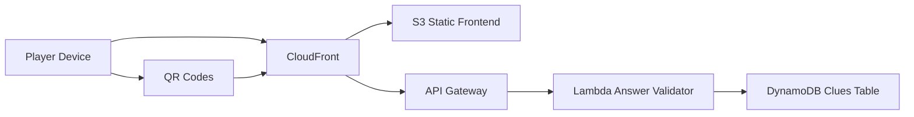

# Mermaids and Pirates Treasure Hunt

## Project Summary

Mermaids and Pirates Treasure Hunt is a QR-driven scavenger hunt web app for a themed birthday adventure.
Players scan clue links, answer multiple-choice questions, and receive the next location hint after a correct response.

The app supports:
- Hosted mode backed by AWS API Gateway + Lambda + DynamoDB.
- Local mode that falls back to seed data for offline testing.

## Built With AI

This project was built with AI-assisted development using GitHub Copilot and iterative prompt-driven implementation.

- AI was used to accelerate architecture, frontend logic, backend API design, deployment scripting, and documentation drafts.
- Final implementation, verification, and customization were reviewed and guided by a human developer.

## Key Features

- QR-code friendly routing with clue IDs in query string format.
- Serverless backend for clue lookup and answer validation.
- Local fallback data source for fast development and demos.
- Progressive score system based on attempts per clue.
- Simple mobile-first UI suitable for phone-based gameplay.
- Deployment helper script for static frontend publishing.

## Architecture



## Technology Stack

- Frontend: HTML, CSS, vanilla JavaScript
- Backend: AWS Lambda (Node.js), API Gateway
- Data: DynamoDB
- Hosting: S3 + CloudFront
- Tooling: PowerShell deployment script, Python seed utilities, Python QR helper

## Repository Structure

- [src/index.html](src/index.html): Main single-page entry.
- [src/script.js](src/script.js): Client gameplay logic, API calls, score state.
- [src/style.css](src/style.css): Frontend styling.
- [src/images](src/images): Static image assets.
- [lambda/index.js](lambda/index.js): Lambda handler for clue fetch and answer validation.
- [lambda/DEPLOYMENT.md](lambda/DEPLOYMENT.md): Backend/API deployment guide.
- [function/cloudfront-function.js](function/cloudfront-function.js): CloudFront route rewrite function.
- [seed/seed.json](seed/seed.json): Canonical clue data.
- [seed/seed.py](seed/seed.py): DynamoDB seed script.
- [qrcodes/qrcodes.py](qrcodes/qrcodes.py): QR image generator helper.
- [deploy-frontend.ps1](deploy-frontend.ps1): Frontend deployment helper script.
- [PLAN.md](PLAN.md): Milestone-oriented project plan.

## API Contract

### GET /clue?id=N

Returns public clue fields:
- id
- question
- choices
- nextClueId
- hint

### POST /answer

Request body:

```json
{
  "clueId": "1",
  "answer": "Old Oak Tree"
}
```

Response body:

```json
{
  "correct": true,
  "nextClueId": "2",
  "message": "Correct!",
  "hint": "Look where ..."
}
```

## Local Development

From project root:

```bash
python -m http.server 8000
```

Open:

```text
http://localhost:8000/?id=1
```

Behavior:
- If API_BASE_URL is set in [src/index.html](src/index.html), the app calls the deployed API.
- If API_BASE_URL is empty or unavailable, the app falls back to [seed/seed.json](seed/seed.json).

## Seed Data

Seed DynamoDB from the JSON source:

```bash
python seed/seed.py --table Clues --seed seed/seed.json
```

Optional region example:

```bash
python seed/seed.py --table Clues --seed seed/seed.json --region us-east-2
```

## Deployment Overview

### Frontend (S3 + CloudFront)

Use the helper script:

```powershell
.\deploy-frontend.ps1 -BucketName your-bucket-name -DistributionId E1234567890ABC -Region us-east-2
```

If DistributionId is not available yet, run without it first and invalidate later.

### Backend (Lambda + API Gateway + IAM)

Use the full backend guide in [lambda/DEPLOYMENT.md](lambda/DEPLOYMENT.md).

### CloudFront Routing Function

Use [function/cloudfront-function.js](function/cloudfront-function.js) to route extension-less paths like /clue to index.html.

## Project Highlights

- Designed and shipped a complete serverless web application on AWS.
- Implemented API integration, data modeling, and client-side game flow.
- Created deployment automation for static asset publishing and cache invalidation.
- Built fallback-first local developer experience to reduce cloud dependency during iteration.
- Produced clear operational docs and milestone planning for handoff readiness.

## Known Limitations and Next Improvements

- Score state is currently browser-local, not user-authenticated server state.
- Multi-tab same-browser sessions can overwrite local progress due to shared localStorage key.
- Future enhancement: add player identity and server-authoritative progress for multi-player fairness.

## Documentation Organization Recommendation

For long-term maintainability, keep this README focused on project overview and quick start, and keep deep deployment runbooks in dedicated files.

- Backend deployment is correctly placed in [lambda/DEPLOYMENT.md](lambda/DEPLOYMENT.md).
- If frontend hosting steps continue to grow, consider moving detailed S3/CloudFront instructions into a dedicated file such as a frontend deployment runbook under a docs folder, while keeping only a short summary here.
